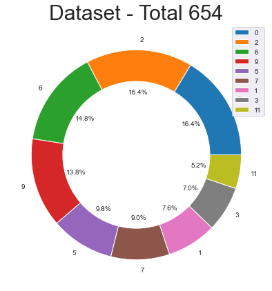
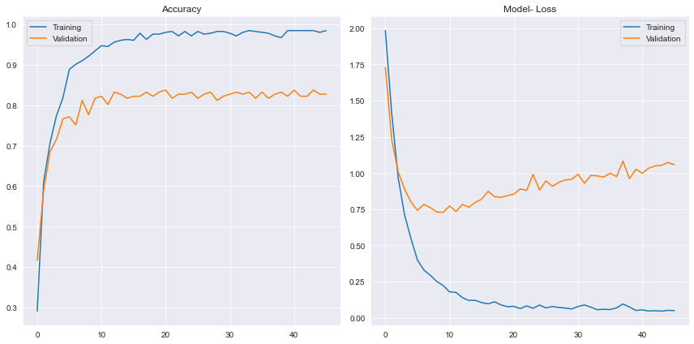
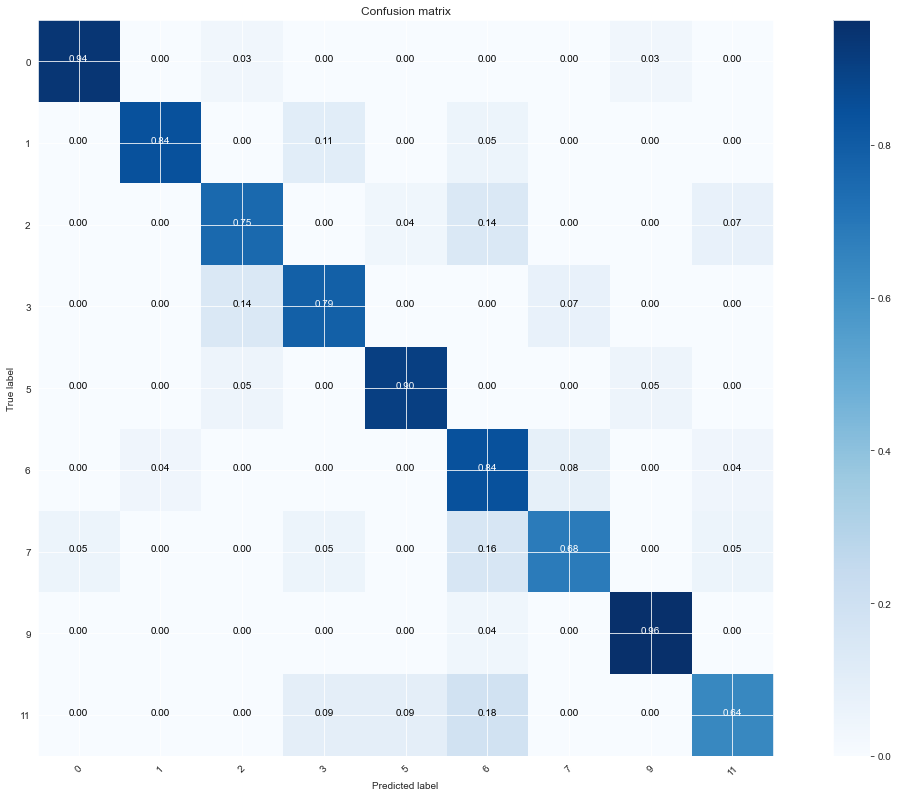
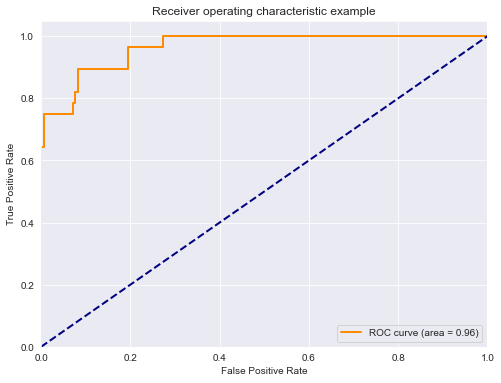
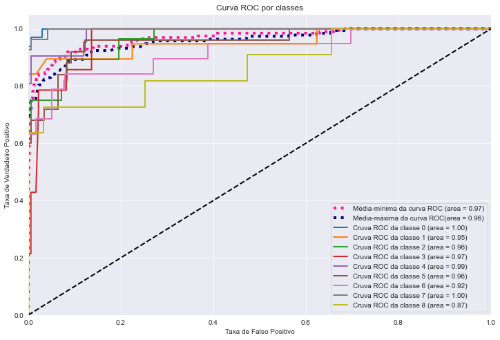

<h1>Previsão de classes de Ransoware

Nome da Familia            ID
<br>
<p>-----------------------------------------</p>
<pre>Goodware            0</pre>
<pre>Critroni            1</pre>
<pre>CryptLocker         2</pre>
<pre>CryptoWall          3</pre>
<pre>KOLLAH              4</pre>
<pre>Kovter              5</pre>
<pre>Locker              6</pre>
<pre>MATSNU              7</pre>
<pre>PGPCODER            8</pre>
<pre>Reveton             9</pre>
<pre>TeslaCrypt         10</pre>
<pre>Trojan-Ransom      11</pre>


```python
from keras.callbacks import EarlyStopping, ModelCheckpoint
from sklearn.model_selection import train_test_split
from sklearn.metrics import confusion_matrix
from sklearn.decomposition import PCA
from keras.models import Sequential
from sklearn import preprocessing
from keras.layers import Dense
from sklearn import metrics
import pandasql as ps
from utilsIA import *
import pandas as pd
import numpy as np
import itertools
```

<h2>Leitura do dataset


```python
path = 'Ransoware.xlsx'
dataset = pd.read_excel(path)
dataset
```


<div>

<table border="1" class="dataframe">
  <thead>
    <tr style="text-align: right;">
      <th></th>
      <th>Ransomware</th>
      <th>Classe</th>
      <th>4</th>
      <th>6</th>
      <th>8</th>
      <th>9</th>
      <th>10</th>
      <th>11</th>
      <th>12</th>
      <th>14</th>
      <th>...</th>
      <th>29079</th>
      <th>29218</th>
      <th>29287</th>
      <th>29758</th>
      <th>29769</th>
      <th>29770</th>
      <th>29796</th>
      <th>29903</th>
      <th>30200</th>
      <th>30285</th>
    </tr>
  </thead>
  <tbody>
    <tr>
      <th>0</th>
      <td>0</td>
      <td>0</td>
      <td>0</td>
      <td>0</td>
      <td>0</td>
      <td>0</td>
      <td>0</td>
      <td>0</td>
      <td>0</td>
      <td>0</td>
      <td>...</td>
      <td>0</td>
      <td>0</td>
      <td>0</td>
      <td>0</td>
      <td>1</td>
      <td>0</td>
      <td>0</td>
      <td>0</td>
      <td>1</td>
      <td>1</td>
    </tr>
    <tr>
      <th>1</th>
      <td>0</td>
      <td>0</td>
      <td>1</td>
      <td>0</td>
      <td>0</td>
      <td>0</td>
      <td>0</td>
      <td>0</td>
      <td>0</td>
      <td>0</td>
      <td>...</td>
      <td>0</td>
      <td>0</td>
      <td>0</td>
      <td>0</td>
      <td>1</td>
      <td>0</td>
      <td>0</td>
      <td>0</td>
      <td>0</td>
      <td>0</td>
    </tr>
    <tr>
      <th>2</th>
      <td>1</td>
      <td>4</td>
      <td>0</td>
      <td>0</td>
      <td>0</td>
      <td>0</td>
      <td>0</td>
      <td>0</td>
      <td>0</td>
      <td>0</td>
      <td>...</td>
      <td>0</td>
      <td>0</td>
      <td>0</td>
      <td>0</td>
      <td>1</td>
      <td>0</td>
      <td>0</td>
      <td>0</td>
      <td>0</td>
      <td>0</td>
    </tr>
    <tr>
      <th>3</th>
      <td>0</td>
      <td>0</td>
      <td>1</td>
      <td>1</td>
      <td>1</td>
      <td>1</td>
      <td>1</td>
      <td>0</td>
      <td>1</td>
      <td>0</td>
      <td>...</td>
      <td>0</td>
      <td>0</td>
      <td>0</td>
      <td>0</td>
      <td>0</td>
      <td>0</td>
      <td>0</td>
      <td>0</td>
      <td>0</td>
      <td>0</td>
    </tr>
    <tr>
      <th>4</th>
      <td>0</td>
      <td>0</td>
      <td>0</td>
      <td>1</td>
      <td>0</td>
      <td>1</td>
      <td>1</td>
      <td>0</td>
      <td>0</td>
      <td>0</td>
      <td>...</td>
      <td>0</td>
      <td>0</td>
      <td>0</td>
      <td>0</td>
      <td>0</td>
      <td>0</td>
      <td>0</td>
      <td>0</td>
      <td>0</td>
      <td>0</td>
    </tr>
    <tr>
      <th>...</th>
      <td>...</td>
      <td>...</td>
      <td>...</td>
      <td>...</td>
      <td>...</td>
      <td>...</td>
      <td>...</td>
      <td>...</td>
      <td>...</td>
      <td>...</td>
      <td>...</td>
      <td>...</td>
      <td>...</td>
      <td>...</td>
      <td>...</td>
      <td>...</td>
      <td>...</td>
      <td>...</td>
      <td>...</td>
      <td>...</td>
      <td>...</td>
    </tr>
    <tr>
      <th>1519</th>
      <td>1</td>
      <td>4</td>
      <td>0</td>
      <td>1</td>
      <td>0</td>
      <td>0</td>
      <td>0</td>
      <td>0</td>
      <td>0</td>
      <td>0</td>
      <td>...</td>
      <td>0</td>
      <td>0</td>
      <td>0</td>
      <td>0</td>
      <td>1</td>
      <td>0</td>
      <td>0</td>
      <td>0</td>
      <td>1</td>
      <td>1</td>
    </tr>
    <tr>
      <th>1520</th>
      <td>0</td>
      <td>0</td>
      <td>1</td>
      <td>1</td>
      <td>1</td>
      <td>0</td>
      <td>1</td>
      <td>0</td>
      <td>1</td>
      <td>1</td>
      <td>...</td>
      <td>0</td>
      <td>0</td>
      <td>0</td>
      <td>0</td>
      <td>0</td>
      <td>0</td>
      <td>0</td>
      <td>0</td>
      <td>0</td>
      <td>0</td>
    </tr>
    <tr>
      <th>1521</th>
      <td>0</td>
      <td>0</td>
      <td>1</td>
      <td>1</td>
      <td>1</td>
      <td>0</td>
      <td>0</td>
      <td>0</td>
      <td>0</td>
      <td>0</td>
      <td>...</td>
      <td>0</td>
      <td>0</td>
      <td>0</td>
      <td>0</td>
      <td>1</td>
      <td>0</td>
      <td>1</td>
      <td>0</td>
      <td>0</td>
      <td>0</td>
    </tr>
    <tr>
      <th>1522</th>
      <td>1</td>
      <td>4</td>
      <td>0</td>
      <td>0</td>
      <td>0</td>
      <td>0</td>
      <td>0</td>
      <td>0</td>
      <td>0</td>
      <td>0</td>
      <td>...</td>
      <td>1</td>
      <td>0</td>
      <td>0</td>
      <td>0</td>
      <td>1</td>
      <td>0</td>
      <td>0</td>
      <td>0</td>
      <td>0</td>
      <td>0</td>
    </tr>
    <tr>
      <th>1523</th>
      <td>0</td>
      <td>0</td>
      <td>1</td>
      <td>1</td>
      <td>1</td>
      <td>0</td>
      <td>1</td>
      <td>0</td>
      <td>1</td>
      <td>0</td>
      <td>...</td>
      <td>0</td>
      <td>0</td>
      <td>0</td>
      <td>0</td>
      <td>0</td>
      <td>0</td>
      <td>0</td>
      <td>0</td>
      <td>0</td>
      <td>0</td>
    </tr>
  </tbody>
</table>
<p>1524 rows × 931 columns</p>
</div>


<h2>Redução da dimensão do dataset usando PCA</h2>
<LI>Reduzindo as 929 colunas de modo que mantenha uma alta representatividade com os dados originais


```python
train_row = 900
columns = 929
column_init = 2
column_label = 1

train_label = dataset.iloc[:train_row, column_label]
train_data = dataset.iloc[:train_row, column_init:columns+column_init]

test_label = dataset.iloc[train_row:, column_label].reset_index(drop=True)
test_data = dataset.iloc[train_row:, column_init:columns + column_init].reset_index(drop=True)
```


```python
n_comp = 165
pca = PCA(n_components=n_comp)
X_train_pca = pca.fit_transform(train_data.values)
X_test_pca = pca.transform(test_data.values)
print(f'Representação: {pca.explained_variance_ratio_.sum()}')
```

    Representação: 0.9715453985161124
    


```python
X_train_pca = pd.DataFrame(X_train_pca)
X_test_pca = pd.DataFrame(X_test_pca)
df = pd.concat([X_train_pca, X_test_pca]).reset_index()
df['Classe']  = dataset['Classe']
df
```


<div>
<table border="1" class="dataframe">
  <thead>
    <tr style="text-align: right;">
      <th></th>
      <th>index</th>
      <th>0</th>
      <th>1</th>
      <th>2</th>
      <th>3</th>
      <th>4</th>
      <th>5</th>
      <th>6</th>
      <th>7</th>
      <th>8</th>
      <th>...</th>
      <th>156</th>
      <th>157</th>
      <th>158</th>
      <th>159</th>
      <th>160</th>
      <th>161</th>
      <th>162</th>
      <th>163</th>
      <th>164</th>
      <th>Classe</th>
    </tr>
  </thead>
  <tbody>
    <tr>
      <th>0</th>
      <td>0</td>
      <td>-4.821125</td>
      <td>-0.487440</td>
      <td>-2.201017</td>
      <td>1.152447</td>
      <td>-0.033623</td>
      <td>1.352974</td>
      <td>-0.578600</td>
      <td>0.059564</td>
      <td>0.038959</td>
      <td>...</td>
      <td>-0.053499</td>
      <td>0.311921</td>
      <td>-0.050478</td>
      <td>-0.117299</td>
      <td>0.066474</td>
      <td>-0.203876</td>
      <td>0.246825</td>
      <td>-0.010021</td>
      <td>-0.282411</td>
      <td>0</td>
    </tr>
    <tr>
      <th>1</th>
      <td>1</td>
      <td>-3.116892</td>
      <td>-0.320086</td>
      <td>-0.468679</td>
      <td>0.077390</td>
      <td>-0.733340</td>
      <td>-0.059672</td>
      <td>0.296803</td>
      <td>-0.416835</td>
      <td>-0.452211</td>
      <td>...</td>
      <td>-0.268512</td>
      <td>0.186507</td>
      <td>0.044608</td>
      <td>0.237524</td>
      <td>0.141487</td>
      <td>-0.163366</td>
      <td>-0.133308</td>
      <td>-0.139559</td>
      <td>0.031824</td>
      <td>0</td>
    </tr>
    <tr>
      <th>2</th>
      <td>2</td>
      <td>-4.817464</td>
      <td>-0.726339</td>
      <td>-2.223047</td>
      <td>0.763878</td>
      <td>0.408207</td>
      <td>0.848962</td>
      <td>-0.412907</td>
      <td>0.157133</td>
      <td>0.103711</td>
      <td>...</td>
      <td>0.115069</td>
      <td>-0.030130</td>
      <td>0.102367</td>
      <td>0.148219</td>
      <td>-0.342858</td>
      <td>0.129300</td>
      <td>-0.067159</td>
      <td>-0.014187</td>
      <td>0.124248</td>
      <td>4</td>
    </tr>
    <tr>
      <th>3</th>
      <td>3</td>
      <td>5.331648</td>
      <td>-2.676628</td>
      <td>1.265138</td>
      <td>0.893076</td>
      <td>1.153713</td>
      <td>-0.109961</td>
      <td>0.198922</td>
      <td>-0.561980</td>
      <td>-0.057770</td>
      <td>...</td>
      <td>0.036511</td>
      <td>-0.175244</td>
      <td>-0.323986</td>
      <td>-0.024850</td>
      <td>0.179646</td>
      <td>-0.095332</td>
      <td>-0.081275</td>
      <td>-0.192800</td>
      <td>0.104840</td>
      <td>0</td>
    </tr>
    <tr>
      <th>4</th>
      <td>4</td>
      <td>4.054361</td>
      <td>1.525786</td>
      <td>-0.874177</td>
      <td>-0.684646</td>
      <td>-0.014614</td>
      <td>-0.708375</td>
      <td>0.977450</td>
      <td>0.126336</td>
      <td>-0.524389</td>
      <td>...</td>
      <td>-0.058353</td>
      <td>-0.232046</td>
      <td>-0.426571</td>
      <td>0.095166</td>
      <td>-0.060333</td>
      <td>-0.154573</td>
      <td>-0.096402</td>
      <td>-0.048692</td>
      <td>0.468370</td>
      <td>0</td>
    </tr>
    <tr>
      <th>...</th>
      <td>...</td>
      <td>...</td>
      <td>...</td>
      <td>...</td>
      <td>...</td>
      <td>...</td>
      <td>...</td>
      <td>...</td>
      <td>...</td>
      <td>...</td>
      <td>...</td>
      <td>...</td>
      <td>...</td>
      <td>...</td>
      <td>...</td>
      <td>...</td>
      <td>...</td>
      <td>...</td>
      <td>...</td>
      <td>...</td>
      <td>...</td>
    </tr>
    <tr>
      <th>1519</th>
      <td>619</td>
      <td>-3.667744</td>
      <td>-0.287221</td>
      <td>-0.377622</td>
      <td>-0.285508</td>
      <td>-0.173065</td>
      <td>-0.097861</td>
      <td>-0.031989</td>
      <td>-0.025919</td>
      <td>0.053390</td>
      <td>...</td>
      <td>-0.033192</td>
      <td>0.723736</td>
      <td>-0.231849</td>
      <td>-0.136856</td>
      <td>-0.090843</td>
      <td>0.277584</td>
      <td>-0.120122</td>
      <td>-0.174936</td>
      <td>-0.394245</td>
      <td>4</td>
    </tr>
    <tr>
      <th>1520</th>
      <td>620</td>
      <td>1.207262</td>
      <td>4.874456</td>
      <td>3.782525</td>
      <td>1.782034</td>
      <td>0.379592</td>
      <td>-0.096894</td>
      <td>-0.562963</td>
      <td>1.003049</td>
      <td>-3.265090</td>
      <td>...</td>
      <td>-0.010782</td>
      <td>-0.362701</td>
      <td>-0.555329</td>
      <td>0.299275</td>
      <td>0.414574</td>
      <td>0.270008</td>
      <td>-0.037364</td>
      <td>-0.070711</td>
      <td>0.199022</td>
      <td>0</td>
    </tr>
    <tr>
      <th>1521</th>
      <td>621</td>
      <td>3.961603</td>
      <td>1.436517</td>
      <td>-1.136199</td>
      <td>-0.921292</td>
      <td>-0.807843</td>
      <td>0.733954</td>
      <td>1.622033</td>
      <td>-2.877845</td>
      <td>0.001690</td>
      <td>...</td>
      <td>-0.072145</td>
      <td>-0.226455</td>
      <td>0.478052</td>
      <td>0.026402</td>
      <td>0.172154</td>
      <td>0.158334</td>
      <td>-0.144294</td>
      <td>-0.308613</td>
      <td>-0.207756</td>
      <td>0</td>
    </tr>
    <tr>
      <th>1522</th>
      <td>622</td>
      <td>-4.470373</td>
      <td>-0.806404</td>
      <td>-1.547585</td>
      <td>0.073598</td>
      <td>0.697804</td>
      <td>0.348658</td>
      <td>-0.494289</td>
      <td>0.044260</td>
      <td>0.074465</td>
      <td>...</td>
      <td>-0.149596</td>
      <td>-0.241636</td>
      <td>0.059691</td>
      <td>0.157608</td>
      <td>0.282329</td>
      <td>0.006757</td>
      <td>-0.122828</td>
      <td>-0.280303</td>
      <td>-0.022284</td>
      <td>4</td>
    </tr>
    <tr>
      <th>1523</th>
      <td>623</td>
      <td>5.259862</td>
      <td>-3.403548</td>
      <td>0.995541</td>
      <td>1.227109</td>
      <td>0.961682</td>
      <td>0.304587</td>
      <td>-0.072982</td>
      <td>-0.855472</td>
      <td>0.098563</td>
      <td>...</td>
      <td>0.031373</td>
      <td>0.019168</td>
      <td>-0.094154</td>
      <td>0.007101</td>
      <td>-0.000693</td>
      <td>0.014536</td>
      <td>-0.059940</td>
      <td>-0.031743</td>
      <td>0.070975</td>
      <td>0</td>
    </tr>
  </tbody>
</table>
<p>1524 rows × 167 columns</p>
</div>


<h3>Verificando a quantidade de cada Classe dentro do dataset


```python
q1 = """
SELECT distinct count(*) as Quantidade,  Classe
FROM dataset 
group by Classe
order by Quantidade desc"""

ps.sqldf(q1)
```


<div>
<style scoped>
    .dataframe tbody tr th:only-of-type {
        vertical-align: middle;
    }

    .dataframe tbody tr th {
        vertical-align: top;
    }

    .dataframe thead th {
        text-align: right;
    }
</style>
<table border="1" class="dataframe">
  <thead>
    <tr style="text-align: right;">
      <th></th>
      <th>Quantidade</th>
      <th>Classe</th>
    </tr>
  </thead>
  <tbody>
    <tr>
      <th>0</th>
      <td>942</td>
      <td>0</td>
    </tr>
    <tr>
      <th>1</th>
      <td>107</td>
      <td>2</td>
    </tr>
    <tr>
      <th>2</th>
      <td>97</td>
      <td>6</td>
    </tr>
    <tr>
      <th>3</th>
      <td>90</td>
      <td>9</td>
    </tr>
    <tr>
      <th>4</th>
      <td>64</td>
      <td>5</td>
    </tr>
    <tr>
      <th>5</th>
      <td>59</td>
      <td>7</td>
    </tr>
    <tr>
      <th>6</th>
      <td>50</td>
      <td>1</td>
    </tr>
    <tr>
      <th>7</th>
      <td>46</td>
      <td>3</td>
    </tr>
    <tr>
      <th>8</th>
      <td>34</td>
      <td>11</td>
    </tr>
    <tr>
      <th>9</th>
      <td>25</td>
      <td>4</td>
    </tr>
    <tr>
      <th>10</th>
      <td>6</td>
      <td>10</td>
    </tr>
    <tr>
      <th>11</th>
      <td>4</td>
      <td>8</td>
    </tr>
  </tbody>
</table>
</div>


<h3>Exclusão das classes com poucas ocorrências</h3>
<li>Treinamento insuficiente do modelo</li>
<li>Teste insuficiente do modelo</li>
<li>Evitar alta acurácia por aleatoriedade</li>


```python
df.drop(df.loc[df['Classe']==8].index, inplace=True)
df.drop(df.loc[df['Classe']==10].index, inplace=True)
df.drop(df.loc[df['Classe']==4].index, inplace=True)
df.drop('index', 1, inplace=True)
df
```

    C:\Users\Edno\AppData\Local\Temp/ipykernel_5244/4213288135.py:4: FutureWarning: In a future version of pandas all arguments of DataFrame.drop except for the argument 'labels' will be keyword-only
      df.drop('index', 1, inplace=True)
    


<div>
<style scoped>
    .dataframe tbody tr th:only-of-type {
        vertical-align: middle;
    }

    .dataframe tbody tr th {
        vertical-align: top;
    }

    .dataframe thead th {
        text-align: right;
    }
</style>
<table border="1" class="dataframe">
  <thead>
    <tr style="text-align: right;">
      <th></th>
      <th>0</th>
      <th>1</th>
      <th>2</th>
      <th>3</th>
      <th>4</th>
      <th>5</th>
      <th>6</th>
      <th>7</th>
      <th>8</th>
      <th>9</th>
      <th>...</th>
      <th>156</th>
      <th>157</th>
      <th>158</th>
      <th>159</th>
      <th>160</th>
      <th>161</th>
      <th>162</th>
      <th>163</th>
      <th>164</th>
      <th>Classe</th>
    </tr>
  </thead>
  <tbody>
    <tr>
      <th>0</th>
      <td>-4.821125</td>
      <td>-0.487440</td>
      <td>-2.201017</td>
      <td>1.152447</td>
      <td>-0.033623</td>
      <td>1.352974</td>
      <td>-0.578600</td>
      <td>0.059564</td>
      <td>0.038959</td>
      <td>0.154728</td>
      <td>...</td>
      <td>-0.053499</td>
      <td>0.311921</td>
      <td>-0.050478</td>
      <td>-0.117299</td>
      <td>0.066474</td>
      <td>-0.203876</td>
      <td>0.246825</td>
      <td>-0.010021</td>
      <td>-0.282411</td>
      <td>0</td>
    </tr>
    <tr>
      <th>1</th>
      <td>-3.116892</td>
      <td>-0.320086</td>
      <td>-0.468679</td>
      <td>0.077390</td>
      <td>-0.733340</td>
      <td>-0.059672</td>
      <td>0.296803</td>
      <td>-0.416835</td>
      <td>-0.452211</td>
      <td>0.099741</td>
      <td>...</td>
      <td>-0.268512</td>
      <td>0.186507</td>
      <td>0.044608</td>
      <td>0.237524</td>
      <td>0.141487</td>
      <td>-0.163366</td>
      <td>-0.133308</td>
      <td>-0.139559</td>
      <td>0.031824</td>
      <td>0</td>
    </tr>
    <tr>
      <th>3</th>
      <td>5.331648</td>
      <td>-2.676628</td>
      <td>1.265138</td>
      <td>0.893076</td>
      <td>1.153713</td>
      <td>-0.109961</td>
      <td>0.198922</td>
      <td>-0.561980</td>
      <td>-0.057770</td>
      <td>1.013530</td>
      <td>...</td>
      <td>0.036511</td>
      <td>-0.175244</td>
      <td>-0.323986</td>
      <td>-0.024850</td>
      <td>0.179646</td>
      <td>-0.095332</td>
      <td>-0.081275</td>
      <td>-0.192800</td>
      <td>0.104840</td>
      <td>0</td>
    </tr>
    <tr>
      <th>4</th>
      <td>4.054361</td>
      <td>1.525786</td>
      <td>-0.874177</td>
      <td>-0.684646</td>
      <td>-0.014614</td>
      <td>-0.708375</td>
      <td>0.977450</td>
      <td>0.126336</td>
      <td>-0.524389</td>
      <td>-0.025725</td>
      <td>...</td>
      <td>-0.058353</td>
      <td>-0.232046</td>
      <td>-0.426571</td>
      <td>0.095166</td>
      <td>-0.060333</td>
      <td>-0.154573</td>
      <td>-0.096402</td>
      <td>-0.048692</td>
      <td>0.468370</td>
      <td>0</td>
    </tr>
    <tr>
      <th>5</th>
      <td>1.761522</td>
      <td>1.777536</td>
      <td>1.389631</td>
      <td>-0.734398</td>
      <td>-1.769632</td>
      <td>-1.707925</td>
      <td>0.010637</td>
      <td>1.006003</td>
      <td>-1.032105</td>
      <td>0.677926</td>
      <td>...</td>
      <td>-0.066147</td>
      <td>-0.053367</td>
      <td>-0.184165</td>
      <td>-0.156341</td>
      <td>0.059520</td>
      <td>-0.043059</td>
      <td>-0.013471</td>
      <td>-0.092569</td>
      <td>0.110692</td>
      <td>0</td>
    </tr>
    <tr>
      <th>...</th>
      <td>...</td>
      <td>...</td>
      <td>...</td>
      <td>...</td>
      <td>...</td>
      <td>...</td>
      <td>...</td>
      <td>...</td>
      <td>...</td>
      <td>...</td>
      <td>...</td>
      <td>...</td>
      <td>...</td>
      <td>...</td>
      <td>...</td>
      <td>...</td>
      <td>...</td>
      <td>...</td>
      <td>...</td>
      <td>...</td>
      <td>...</td>
    </tr>
    <tr>
      <th>1516</th>
      <td>5.471322</td>
      <td>1.039605</td>
      <td>-4.132083</td>
      <td>0.309695</td>
      <td>-2.036437</td>
      <td>0.087284</td>
      <td>0.457468</td>
      <td>-0.841350</td>
      <td>-0.999483</td>
      <td>-1.548910</td>
      <td>...</td>
      <td>0.175220</td>
      <td>-0.015662</td>
      <td>-0.196201</td>
      <td>-0.293100</td>
      <td>-0.004059</td>
      <td>-0.188156</td>
      <td>0.085008</td>
      <td>0.043024</td>
      <td>0.112271</td>
      <td>0</td>
    </tr>
    <tr>
      <th>1517</th>
      <td>5.177134</td>
      <td>-3.400939</td>
      <td>1.034620</td>
      <td>1.240165</td>
      <td>0.937027</td>
      <td>0.308304</td>
      <td>-0.070532</td>
      <td>-0.924902</td>
      <td>0.166870</td>
      <td>1.175099</td>
      <td>...</td>
      <td>0.038146</td>
      <td>-0.034900</td>
      <td>-0.006361</td>
      <td>-0.103692</td>
      <td>-0.046950</td>
      <td>0.016334</td>
      <td>-0.074340</td>
      <td>-0.039927</td>
      <td>-0.009890</td>
      <td>0</td>
    </tr>
    <tr>
      <th>1520</th>
      <td>1.207262</td>
      <td>4.874456</td>
      <td>3.782525</td>
      <td>1.782034</td>
      <td>0.379592</td>
      <td>-0.096894</td>
      <td>-0.562963</td>
      <td>1.003049</td>
      <td>-3.265090</td>
      <td>4.992138</td>
      <td>...</td>
      <td>-0.010782</td>
      <td>-0.362701</td>
      <td>-0.555329</td>
      <td>0.299275</td>
      <td>0.414574</td>
      <td>0.270008</td>
      <td>-0.037364</td>
      <td>-0.070711</td>
      <td>0.199022</td>
      <td>0</td>
    </tr>
    <tr>
      <th>1521</th>
      <td>3.961603</td>
      <td>1.436517</td>
      <td>-1.136199</td>
      <td>-0.921292</td>
      <td>-0.807843</td>
      <td>0.733954</td>
      <td>1.622033</td>
      <td>-2.877845</td>
      <td>0.001690</td>
      <td>2.131293</td>
      <td>...</td>
      <td>-0.072145</td>
      <td>-0.226455</td>
      <td>0.478052</td>
      <td>0.026402</td>
      <td>0.172154</td>
      <td>0.158334</td>
      <td>-0.144294</td>
      <td>-0.308613</td>
      <td>-0.207756</td>
      <td>0</td>
    </tr>
    <tr>
      <th>1523</th>
      <td>5.259862</td>
      <td>-3.403548</td>
      <td>0.995541</td>
      <td>1.227109</td>
      <td>0.961682</td>
      <td>0.304587</td>
      <td>-0.072982</td>
      <td>-0.855472</td>
      <td>0.098563</td>
      <td>1.115860</td>
      <td>...</td>
      <td>0.031373</td>
      <td>0.019168</td>
      <td>-0.094154</td>
      <td>0.007101</td>
      <td>-0.000693</td>
      <td>0.014536</td>
      <td>-0.059940</td>
      <td>-0.031743</td>
      <td>0.070975</td>
      <td>0</td>
    </tr>
  </tbody>
</table>
<p>1489 rows × 166 columns</p>
</div>


```python
q1 = """
SELECT distinct count(*) as Quantidade,  Classe
FROM df 
group by Classe
order by Quantidade desc"""

ps.sqldf(q1)
```


<div>
<style scoped>
    .dataframe tbody tr th:only-of-type {
        vertical-align: middle;
    }

    .dataframe tbody tr th {
        vertical-align: top;
    }

    .dataframe thead th {
        text-align: right;
    }
</style>
<table border="1" class="dataframe">
  <thead>
    <tr style="text-align: right;">
      <th></th>
      <th>Quantidade</th>
      <th>Classe</th>
    </tr>
  </thead>
  <tbody>
    <tr>
      <th>0</th>
      <td>942</td>
      <td>0</td>
    </tr>
    <tr>
      <th>1</th>
      <td>107</td>
      <td>2</td>
    </tr>
    <tr>
      <th>2</th>
      <td>97</td>
      <td>6</td>
    </tr>
    <tr>
      <th>3</th>
      <td>90</td>
      <td>9</td>
    </tr>
    <tr>
      <th>4</th>
      <td>64</td>
      <td>5</td>
    </tr>
    <tr>
      <th>5</th>
      <td>59</td>
      <td>7</td>
    </tr>
    <tr>
      <th>6</th>
      <td>50</td>
      <td>1</td>
    </tr>
    <tr>
      <th>7</th>
      <td>46</td>
      <td>3</td>
    </tr>
    <tr>
      <th>8</th>
      <td>34</td>
      <td>11</td>
    </tr>
  </tbody>
</table>
</div>


<h3>Redução da quantidade de registros da categoria '0' para redução da chance de<br>
enviesamento do modelo para esta classe


```python
df_balanced = ProcessingData.balancedData(df, 'Classe', 107)
#df_balanced = df
```


    

    


```python
ProcessingData.showLabelsQtd(df_balanced, 'Classe')
```

    
    Quantidade de itens nas 9 categorias:
    0     107
    2     107
    6      97
    9      90
    5      64
    7      59
    1      50
    3      46
    11     34
    Name: Classe, dtype: int64
    


```python
#Colocando a coluna 'Classe' na primeira posição
col = ['Classe'] + [c for c in range(n_comp)]
df_balanced = df_balanced[col]
df_balanced.head()
```


<div>
<style scoped>
    .dataframe tbody tr th:only-of-type {
        vertical-align: middle;
    }

    .dataframe tbody tr th {
        vertical-align: top;
    }

    .dataframe thead th {
        text-align: right;
    }
</style>
<table border="1" class="dataframe">
  <thead>
    <tr style="text-align: right;">
      <th></th>
      <th>Classe</th>
      <th>0</th>
      <th>1</th>
      <th>2</th>
      <th>3</th>
      <th>4</th>
      <th>5</th>
      <th>6</th>
      <th>7</th>
      <th>8</th>
      <th>...</th>
      <th>155</th>
      <th>156</th>
      <th>157</th>
      <th>158</th>
      <th>159</th>
      <th>160</th>
      <th>161</th>
      <th>162</th>
      <th>163</th>
      <th>164</th>
    </tr>
  </thead>
  <tbody>
    <tr>
      <th>1112</th>
      <td>0</td>
      <td>5.050851</td>
      <td>-3.437326</td>
      <td>0.880903</td>
      <td>1.284616</td>
      <td>1.039539</td>
      <td>0.332499</td>
      <td>-0.112654</td>
      <td>-0.929544</td>
      <td>0.185957</td>
      <td>...</td>
      <td>-0.003749</td>
      <td>0.007185</td>
      <td>-0.091705</td>
      <td>0.030639</td>
      <td>-0.184883</td>
      <td>-0.014107</td>
      <td>0.023129</td>
      <td>-0.065869</td>
      <td>-0.118227</td>
      <td>0.052917</td>
    </tr>
    <tr>
      <th>904</th>
      <td>0</td>
      <td>-4.744892</td>
      <td>-1.090630</td>
      <td>-1.894263</td>
      <td>0.623459</td>
      <td>0.556025</td>
      <td>0.847031</td>
      <td>-0.458654</td>
      <td>0.282898</td>
      <td>0.140678</td>
      <td>...</td>
      <td>-0.006809</td>
      <td>0.061832</td>
      <td>0.089955</td>
      <td>-0.009707</td>
      <td>0.050636</td>
      <td>-0.008242</td>
      <td>0.017653</td>
      <td>0.002273</td>
      <td>0.099682</td>
      <td>-0.081503</td>
    </tr>
    <tr>
      <th>1018</th>
      <td>0</td>
      <td>-0.894416</td>
      <td>1.380315</td>
      <td>0.817547</td>
      <td>0.487481</td>
      <td>-3.652643</td>
      <td>-0.308384</td>
      <td>0.959425</td>
      <td>0.111086</td>
      <td>-0.468956</td>
      <td>...</td>
      <td>0.020760</td>
      <td>-0.028250</td>
      <td>0.168435</td>
      <td>-0.041256</td>
      <td>-0.425442</td>
      <td>0.265058</td>
      <td>0.060733</td>
      <td>0.246020</td>
      <td>0.026194</td>
      <td>-0.033660</td>
    </tr>
    <tr>
      <th>294</th>
      <td>0</td>
      <td>5.585781</td>
      <td>-3.418598</td>
      <td>1.011767</td>
      <td>1.184437</td>
      <td>1.192173</td>
      <td>0.112080</td>
      <td>-0.042108</td>
      <td>-0.783191</td>
      <td>-0.261409</td>
      <td>...</td>
      <td>0.015675</td>
      <td>-0.016180</td>
      <td>-0.023752</td>
      <td>0.092484</td>
      <td>-0.102187</td>
      <td>-0.064161</td>
      <td>0.023080</td>
      <td>0.000156</td>
      <td>-0.029936</td>
      <td>-0.090316</td>
    </tr>
    <tr>
      <th>1355</th>
      <td>0</td>
      <td>4.773488</td>
      <td>0.741391</td>
      <td>-3.426230</td>
      <td>0.476568</td>
      <td>-1.845094</td>
      <td>-0.454420</td>
      <td>1.943682</td>
      <td>-1.763280</td>
      <td>-0.361983</td>
      <td>...</td>
      <td>-0.238522</td>
      <td>-0.164905</td>
      <td>0.178833</td>
      <td>0.062664</td>
      <td>0.089606</td>
      <td>-0.098259</td>
      <td>0.022611</td>
      <td>0.108016</td>
      <td>-0.008297</td>
      <td>0.028628</td>
    </tr>
  </tbody>
</table>
<p>5 rows × 166 columns</p>
</div>


<H2>Aplicação do One Hot Encode


```python
n_classes = len(df_balanced['Classe'].astype(int).value_counts())

datas = df_balanced.iloc[:, 1:].values

enc = preprocessing.OneHotEncoder()
labels = df_balanced.Classe.to_list()
labels = [[la] for la in labels]
enc.fit(labels)
labels_hot = enc.transform(labels).toarray()
```

<H3>Separando os dados para teste e treino


```python
X_train, X_test, y_train, y_test = train_test_split(datas, labels_hot, test_size=.3, random_state=0)#, stratify=labels)
y_train = np.array(y_train) 
y_test = np.array(y_test) 
```

<H3>Modelo da rede neural utilizada


```python
model = Sequential()
model.add(Dense(380, activation='relu', input_dim=n_comp))
model.add(Dense(160, activation='relu'))
model.add(Dense(90, activation='relu'))
model.add(Dense(45, activation='relu'))
model.add(Dense(n_classes, activation='softmax'))


model.compile(optimizer='adam', loss='categorical_crossentropy', metrics = ['accuracy'])

callbacks = [EarlyStopping(monitor='val_accuracy', patience=25),
        ModelCheckpoint(filepath='best_model.h5', monitor='val_accuracy', save_best_only=True)]


history = model.fit(X_train, y_train, epochs=200, callbacks=callbacks, validation_data=(X_test, y_test), verbose=1)
model.load_weights('best_model.h5')
```

    Epoch 1/200
    15/15 [==============================] - 1s 23ms/step - loss: 1.9844 - accuracy: 0.2910 - val_loss: 1.7298 - val_accuracy: 0.4162
    Epoch 2/200
    15/15 [==============================] - 0s 9ms/step - loss: 1.4077 - accuracy: 0.6105 - val_loss: 1.2256 - val_accuracy: 0.5888
    Epoch 3/200
    15/15 [==============================] - 0s 10ms/step - loss: 0.9652 - accuracy: 0.7068 - val_loss: 1.0074 - val_accuracy: 0.6853
    Epoch 4/200
    15/15 [==============================] - 0s 10ms/step - loss: 0.7094 - accuracy: 0.7746 - val_loss: 0.8882 - val_accuracy: 0.7157
    Epoch 5/200
    15/15 [==============================] - 0s 9ms/step - loss: 0.5448 - accuracy: 0.8184 - val_loss: 0.7992 - val_accuracy: 0.7665
    Epoch 6/200
    15/15 [==============================] - 0s 9ms/step - loss: 0.3985 - accuracy: 0.8884 - val_loss: 0.7419 - val_accuracy: 0.7716
    Epoch 7/200
    15/15 [==============================] - 0s 5ms/step - loss: 0.3295 - accuracy: 0.9015 - val_loss: 0.7838 - val_accuracy: 0.7513
    Epoch 8/200
    15/15 [==============================] - 0s 9ms/step - loss: 0.2932 - accuracy: 0.9103 - val_loss: 0.7610 - val_accuracy: 0.8122
    Epoch 9/200
    15/15 [==============================] - 0s 5ms/step - loss: 0.2505 - accuracy: 0.9212 - val_loss: 0.7309 - val_accuracy: 0.7766
    Epoch 10/200
    15/15 [==============================] - 0s 9ms/step - loss: 0.2223 - accuracy: 0.9344 - val_loss: 0.7284 - val_accuracy: 0.8173
    Epoch 11/200
    15/15 [==============================] - 0s 9ms/step - loss: 0.1786 - accuracy: 0.9475 - val_loss: 0.7725 - val_accuracy: 0.8223
    Epoch 12/200
    15/15 [==============================] - 0s 6ms/step - loss: 0.1751 - accuracy: 0.9453 - val_loss: 0.7342 - val_accuracy: 0.8020
    Epoch 13/200
    15/15 [==============================] - 0s 9ms/step - loss: 0.1385 - accuracy: 0.9562 - val_loss: 0.7827 - val_accuracy: 0.8325
    Epoch 14/200
    15/15 [==============================] - 0s 5ms/step - loss: 0.1194 - accuracy: 0.9606 - val_loss: 0.7634 - val_accuracy: 0.8274
    Epoch 15/200
    15/15 [==============================] - 0s 5ms/step - loss: 0.1201 - accuracy: 0.9628 - val_loss: 0.7973 - val_accuracy: 0.8173
    Epoch 16/200
    15/15 [==============================] - 0s 5ms/step - loss: 0.1045 - accuracy: 0.9606 - val_loss: 0.8194 - val_accuracy: 0.8223
    Epoch 17/200
    15/15 [==============================] - 0s 5ms/step - loss: 0.0962 - accuracy: 0.9781 - val_loss: 0.8739 - val_accuracy: 0.8223
    Epoch 18/200
    15/15 [==============================] - 0s 5ms/step - loss: 0.1099 - accuracy: 0.9628 - val_loss: 0.8371 - val_accuracy: 0.8325
    Epoch 19/200
    15/15 [==============================] - 0s 5ms/step - loss: 0.0886 - accuracy: 0.9759 - val_loss: 0.8321 - val_accuracy: 0.8223
    Epoch 20/200
    15/15 [==============================] - 0s 5ms/step - loss: 0.0760 - accuracy: 0.9759 - val_loss: 0.8440 - val_accuracy: 0.8325
    Epoch 21/200
    15/15 [==============================] - 0s 9ms/step - loss: 0.0788 - accuracy: 0.9803 - val_loss: 0.8539 - val_accuracy: 0.8376
    Epoch 22/200
    15/15 [==============================] - 0s 5ms/step - loss: 0.0632 - accuracy: 0.9825 - val_loss: 0.8903 - val_accuracy: 0.8173
    Epoch 23/200
    15/15 [==============================] - 0s 5ms/step - loss: 0.0817 - accuracy: 0.9716 - val_loss: 0.8795 - val_accuracy: 0.8274
    Epoch 24/200
    15/15 [==============================] - 0s 5ms/step - loss: 0.0654 - accuracy: 0.9825 - val_loss: 0.9905 - val_accuracy: 0.8274
    Epoch 25/200
    15/15 [==============================] - 0s 5ms/step - loss: 0.0876 - accuracy: 0.9716 - val_loss: 0.8827 - val_accuracy: 0.8325
    Epoch 26/200
    15/15 [==============================] - 0s 5ms/step - loss: 0.0677 - accuracy: 0.9825 - val_loss: 0.9454 - val_accuracy: 0.8173
    Epoch 27/200
    15/15 [==============================] - 0s 5ms/step - loss: 0.0775 - accuracy: 0.9759 - val_loss: 0.9085 - val_accuracy: 0.8274
    Epoch 28/200
    15/15 [==============================] - 0s 5ms/step - loss: 0.0712 - accuracy: 0.9781 - val_loss: 0.9352 - val_accuracy: 0.8325
    Epoch 29/200
    15/15 [==============================] - 0s 5ms/step - loss: 0.0671 - accuracy: 0.9825 - val_loss: 0.9524 - val_accuracy: 0.8122
    Epoch 30/200
    15/15 [==============================] - 0s 6ms/step - loss: 0.0605 - accuracy: 0.9825 - val_loss: 0.9559 - val_accuracy: 0.8223
    Epoch 31/200
    15/15 [==============================] - 0s 7ms/step - loss: 0.0775 - accuracy: 0.9781 - val_loss: 0.9911 - val_accuracy: 0.8274
    Epoch 32/200
    15/15 [==============================] - 0s 6ms/step - loss: 0.0886 - accuracy: 0.9716 - val_loss: 0.9290 - val_accuracy: 0.8325
    Epoch 33/200
    15/15 [==============================] - 0s 7ms/step - loss: 0.0729 - accuracy: 0.9803 - val_loss: 0.9835 - val_accuracy: 0.8274
    Epoch 34/200
    15/15 [==============================] - 0s 5ms/step - loss: 0.0556 - accuracy: 0.9847 - val_loss: 0.9801 - val_accuracy: 0.8325
    Epoch 35/200
    15/15 [==============================] - 0s 6ms/step - loss: 0.0586 - accuracy: 0.9825 - val_loss: 0.9715 - val_accuracy: 0.8173
    Epoch 36/200
    15/15 [==============================] - 0s 6ms/step - loss: 0.0566 - accuracy: 0.9803 - val_loss: 0.9987 - val_accuracy: 0.8325
    Epoch 37/200
    15/15 [==============================] - 0s 7ms/step - loss: 0.0683 - accuracy: 0.9781 - val_loss: 0.9747 - val_accuracy: 0.8173
    Epoch 38/200
    15/15 [==============================] - 0s 8ms/step - loss: 0.0949 - accuracy: 0.9716 - val_loss: 1.0825 - val_accuracy: 0.8274
    Epoch 39/200
    15/15 [==============================] - 0s 7ms/step - loss: 0.0746 - accuracy: 0.9672 - val_loss: 0.9609 - val_accuracy: 0.8325
    Epoch 40/200
    15/15 [==============================] - 0s 5ms/step - loss: 0.0505 - accuracy: 0.9847 - val_loss: 1.0257 - val_accuracy: 0.8223
    Epoch 41/200
    15/15 [==============================] - 0s 5ms/step - loss: 0.0544 - accuracy: 0.9847 - val_loss: 0.9983 - val_accuracy: 0.8376
    Epoch 42/200
    15/15 [==============================] - 0s 5ms/step - loss: 0.0465 - accuracy: 0.9847 - val_loss: 1.0335 - val_accuracy: 0.8223
    Epoch 43/200
    15/15 [==============================] - 0s 5ms/step - loss: 0.0485 - accuracy: 0.9847 - val_loss: 1.0488 - val_accuracy: 0.8223
    Epoch 44/200
    15/15 [==============================] - 0s 5ms/step - loss: 0.0454 - accuracy: 0.9847 - val_loss: 1.0534 - val_accuracy: 0.8376
    Epoch 45/200
    15/15 [==============================] - 0s 5ms/step - loss: 0.0509 - accuracy: 0.9803 - val_loss: 1.0727 - val_accuracy: 0.8274
    Epoch 46/200
    15/15 [==============================] - 0s 5ms/step - loss: 0.0494 - accuracy: 0.9847 - val_loss: 1.0572 - val_accuracy: 0.8274
    

<h3>Avaliação do modelo</h3>
<li>Histórico da evolução do modelo e sua Loss function</li>
<li>Acurácia do modelo nos dados de teste</li>
<li>Matriz de confução</li>


```python
def plot_confusion_matrix(y_test, y_pred, labels, normalize=False):
    cm = confusion_matrix(y_test, y_pred)

    if normalize:
        cm = cm.astype('float') / cm.sum(axis=1)[:, np.newaxis]
        print("Normalized confusion matrix")
    else:
        print('Confusion matrix, without normalization')

    plt.imshow(cm, interpolation='nearest', cmap=plt.cm.Blues)
    plt.gcf().set_size_inches(17, 11)
    plt.title('Confusion matrix')
    plt.colorbar()
    tick_marks = np.arange(len(labels))
    plt.xticks(tick_marks, labels, rotation=45)
    plt.yticks(tick_marks, labels)

    fmt = '.2f' if normalize else 'd'
    thresh = cm.max() / 2.
    for i, j in itertools.product(range(cm.shape[0]), range(cm.shape[1])):
        plt.text(j, i, format(cm[i, j], fmt),
                 horizontalalignment="center",
                 color="white" if cm[i, j] > thresh else "black")

    plt.tight_layout()
    plt.ylabel('True label')
    plt.xlabel('Predicted label')
    plt.show()

```


```python
def evaluate_model(model, history, X_test, y_test):
    scores = model.evaluate((X_test), y_test, verbose=0)
    print('=========================================')
    print("|| Accuracy: %.2f%%" % (scores[1]*100))
    print('=========================================')

    fig, axs = plt.subplots(1, 2, figsize=(12,6))
    axs[0].plot(history.history['accuracy'])
    axs[0].plot(history.history['val_accuracy'])
    axs[0].set_title("Accuracy")
    axs[0].legend(['Training', 'Validation'])
    axs[1].plot(history.history['loss'])
    axs[1].plot(history.history['val_loss'])
    axs[1].set_title("Model- Loss")
    axs[1].legend(['Training', 'Validation'])
    fig.tight_layout()
```


```python
evaluate_model(model, history, X_test, y_test)
```

    =========================================
    || Accuracy: 83.76%
    =========================================
    


    

    


<h4>OBS: O valores numéricos das classes não correspondem mais com os apresentados no inicio do arquivo


```python
def find_class(probl):
    probl_max = probl.max()
    label = int(np.where(probl == probl_max)[0])

    return  label, round(probl_max*100,1)

prediction_proba = model.predict(X_test)

prediction_cat = [find_class(c)[0] for c in prediction_proba]
y_test_label =  [find_class(c)[0] for c in y_test]


plot_confusion_matrix(y_test_label, prediction_cat, enc.categories_[0], True)
```

    Normalized confusion matrix
    


    

    


<H3>Área Sob a Curva ROC</h3>
<p>Geralmente, a sensibilidade e a especificidade são características difíceis de conciliar, isto é, é complicado aumentar <br>a sensibilidade e a especificidade de um teste ao mesmo tempo. As curvas ROC (receiver operator characteristic curve) <br>são uma forma de representar a relação, normalmente antagónica, entre a sensibilidade e a especificidade de um teste<br> diagnóstico quantitativo, ao longo de um contínuo de valores de "cutoff point".


```python
# Compute ROC curve and ROC area for each class
fpr = dict()
tpr = dict()
roc_auc = dict()
for i in range(n_classes):
    fpr[i], tpr[i], _ = metrics.roc_curve(y_test[:, i], prediction_proba[:, i])
    roc_auc[i] = metrics.auc(fpr[i], tpr[i])

# Compute micro-average ROC curve and ROC area
fpr["micro"], tpr["micro"], _ = metrics.roc_curve(y_test.ravel(), prediction_proba.ravel())
roc_auc["micro"] = metrics.auc(fpr["micro"], tpr["micro"])
```


```python
plt.figure(figsize=(8,6))
lw = 2
plt.plot(
    fpr[2],
    tpr[2],
    color="darkorange",
    lw=lw,
    label="ROC curve (area = %0.2f)" % roc_auc[2],
)
plt.plot([0, 1], [0, 1], color="navy", lw=lw, linestyle="--")
plt.xlim([0.0, 1.0])
plt.ylim([0.0, 1.05])
plt.xlabel("False Positive Rate")
plt.ylabel("True Positive Rate")
plt.title("Receiver operating characteristic example")
plt.legend(loc="lower right")
plt.show()

```


    

    


```python
# First aggregate all false positive rates
all_fpr = np.unique(np.concatenate([fpr[i] for i in range(n_classes)]))

# Then interpolate all ROC curves at this points
mean_tpr = np.zeros_like(all_fpr)
for i in range(n_classes):
    mean_tpr += np.interp(all_fpr, fpr[i], tpr[i])

# Finally average it and compute AUC
mean_tpr /= n_classes

fpr["macro"] = all_fpr
tpr["macro"] = mean_tpr
roc_auc["macro"] = metrics.auc(fpr["macro"], tpr["macro"])

# Plot all ROC curves
plt.figure(figsize=(12,8))
plt.plot(
    fpr["micro"],
    tpr["micro"],
    label="Média-mínima da curva ROC (area = {0:0.2f})".format(roc_auc["micro"]),
    color="deeppink",
    linestyle=":",
    linewidth=4,
)

plt.plot(
    fpr["macro"],
    tpr["macro"],
    label="Média-máxima da curva ROC(area = {0:0.2f})".format(roc_auc["macro"]),
    color="navy",
    linestyle=":",
    linewidth=4,
)

for i in range(n_classes):
    plt.plot(
        fpr[i],
        tpr[i],
        lw=lw,
        label="Cruva ROC da classe {0} (area = {1:0.2f})".format(i, roc_auc[i]),
    )

plt.plot([0, 1], [0, 1], "k--", lw=lw)
plt.xlim([0.0, 1.0])
plt.ylim([0.0, 1.05])
plt.xlabel("Taxa de Falso Positivo")
plt.ylabel("Taxa de Verdadeiro Positivo")
plt.title("Curva ROC por classes")
plt.legend(loc="lower right")
plt.show()
```


    

    

